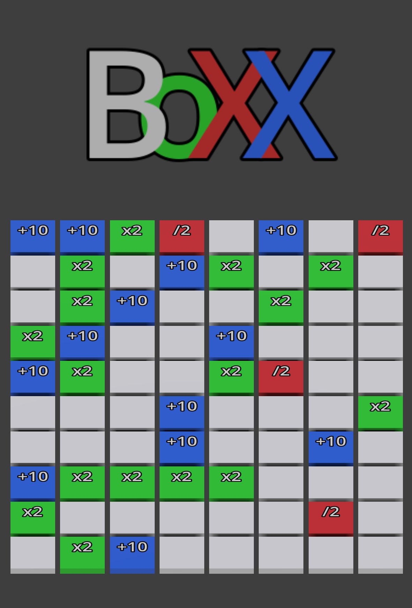

# BoXX



3D isometric grid-based shooter built with Godot 4.6.

Navigate a destructible grid, collect bonuses, and destroy targets before time runs out.

## Controls

| Action | Keys |
|--------|------|
| Move | WASD / Arrow keys |
| Start / Restart | Any key |

## Run

```bash
make start    # launch the game
make restart  # kill + relaunch
make stop     # stop the game
```
